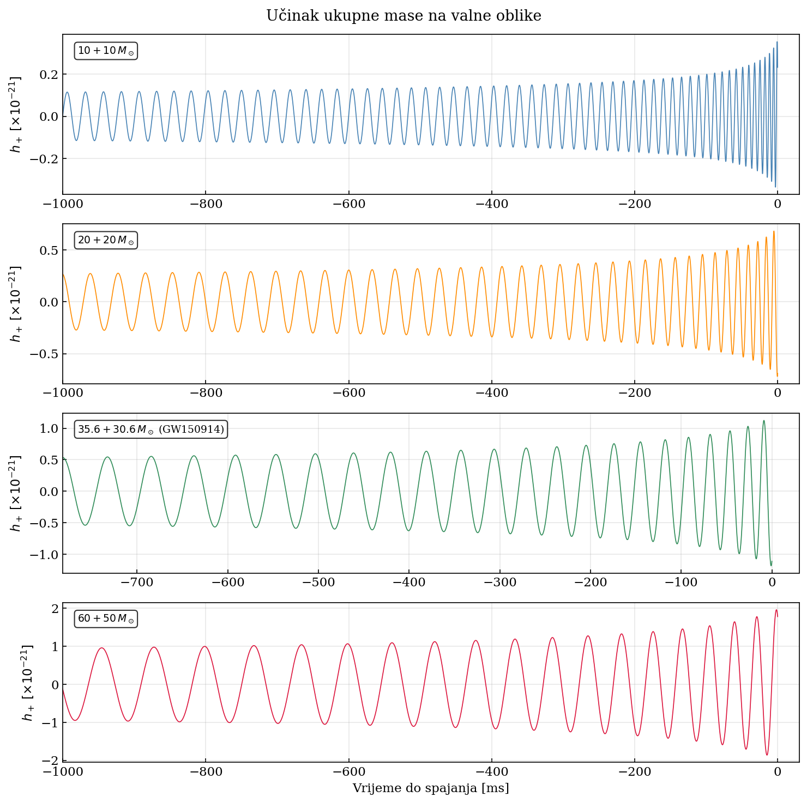

# Gravitational Wave Simulation

A Python simulation framework for modelling gravitational waves from compact binary inspirals using Newtonian and quadrupole approximations.

The project reproduces key observable features of gravitational-wave events such as GW150914, including:

- Orbital inspiral
- Frequency chirp evolution
- Polarized gravitational-wave strain
- Spectrogram generation
- Chirp mass recovery
- Waveform overlap analysis
- Comparison with public LIGO data
  
## Physical Model

The simulation models binary black hole inspirals using:

- Peters–Mathews gravitational radiation formalism
- Quadrupole gravitational-wave emission
- Circular binary approximation
- Inspiral-only waveform generation
- ISCO termination condition

The waveform does NOT currently include:

- Merger phase
- Ringdown phase
- Spin effects
- Eccentric orbits
- Post-Newtonian corrections
- Detector noise modelling

## Repository Structure
```
gw-simulation/
│
├── physics/
│   ├── orbital.py      # Orbital evolution and inspiral dynamics
│   ├── waveform.py     # GW strain generation
│   └── spectrum.py     # FFT and spectrogram analysis
│
├── analysis/
│   ├── comparison.py   # Match filtering and parameter recovery
│   └── gwosc_compare.py# Optional comparison with real LIGO data
│
├── plots/
│   └── visualise.py    # Publication-quality plotting
│
├── results/            # Generated figures
├── main.py             # Main execution script
├── config.py           # Physical constants and configuration
└── requirements.txt
```

## Installation

### 1. Clone the repository

```bash
git clone https://github.com/Lok1wHalo/gw-simulation.git
cd gw-simulation
```

### 2. Create a virtual environment (recommended)

Windows:

```bash
python -m venv venv
venv\Scripts\activate
```

Linux/macOS:

```bash
python3 -m venv venv
source venv/bin/activate
```

### 3. Install dependencies

```bash
pip install -r requirements.txt
```

### 4. Run the simulation

```bash
python main.py
```

Generated plots and figures are automatically saved in the `results/` directory.

**Tested with Python 3.12.**

## Usage

Running the simulation produces:

- Binary inspiral evolution
- Gravitational-wave strain signals
- Frequency-domain spectra
- Spectrogram visualizations
- Comparison plots

Output figures are saved in the `results/` directory.

## Example output


## Key Equations

Chirp mass:

$$M_c = \frac{(m_1 m_2)^{3/5}}{(m_1 + m_2)^{1/5}}$$

Frequency evolution:

$$\frac{df}{dt} = \frac{96}{5}\pi^{\frac{8}{3}}\left(\frac{G M_c}{c^3}\right)^{\frac{5}{3}} f^{\frac{11}{3}}$$

Strain amplitude:

$$h \propto \frac{(G M_c)^{5/3} f^{2/3}}{c^4 d_L}$$

## Limitations

This project is intended for educational and research-demonstration purposes.

The simulation uses Newtonian inspiral approximations and does not reproduce the full numerical-relativity waveform used by LIGO/Virgo collaborations.

## License
This project is open-source and available under the MIT License.
